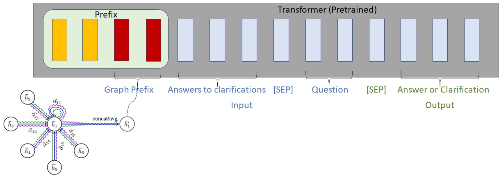

# Graph Prefix



## Dependencies
```
pip install numpy tqdm
pip install torch torchvision
pip install transformers nltk spacy
pip install wandb
pip install tensorboardx
pip install tensorboard

# for torch-geometric
pip install torch-scatter
pip install torch-cluster
pip install torch-sparse
pip install torch-spline-conv
pip install torch-geometric
```
## Download data
You can download all the preprocessed data [here](https://drive.google.com/drive/folders/1T6B4nou5P3u-6jr0z6e3IkitO8fNVM6f?usp=sharing). Download them into the top-level directory of this repo and unzip them. Move the medqa_usmle and ddb folders into the data/ directory.

The resulting file structure should look like this:
```
├── README.md
├── data/
    ├── cpnet/                 (prerocessed ConceptNet)
    ├── csqa/
        ├── train_rand_split.jsonl
        ├── dev_rand_split.jsonl
        ├── test_rand_split_no_answers.jsonl
        ├── statement/             (converted statements)
        ├── grounded/              (grounded entities)
        ├── graphs/                (extracted subgraphs)
        ├── ...
    ├── obqa/
    ├── medqa_usmle/
    └── ddb/
```
